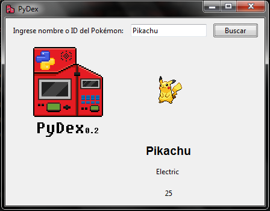

# PyDex

Pydex is a Python GUI program that visualize Pokemon data using the [PokeAPI](https://pokeapi.co) API
Built using Tkinter and urllib

PyDex es un programa escrito en Python que permite visualizar datos de Pokemon usando la API de [PokeAPI](https://pokeapi.co)
Construido usando Tkinter y urllib



## Installation
Install the dependencies:

```bash
pip install pillow

```
Clone this repository and run:

```bash
python3 main.py

```

## Contributing
Pull requests are welcome. For major changes, please open an issue first
to discuss what you would like to change.

## License
[GPLv3](https://choosealicense.com/licenses/gpl-3.0/)
